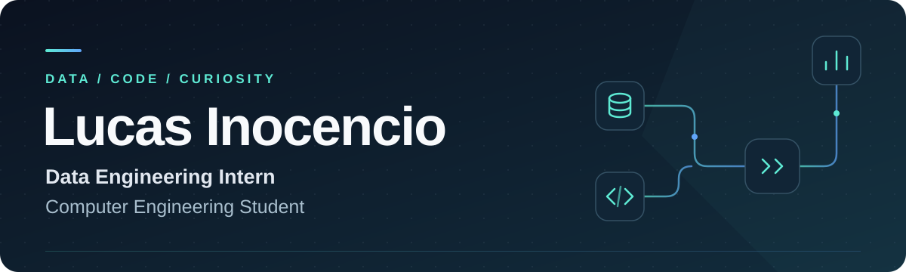



  

  Building reliable pipelines. Making data easier to trust.

  
  

## A little about me

I'm **Lucas**, a **Data Engineering Intern** and **Computer Engineering Student**. I enjoy turning raw data into useful information through reliable pipelines, clear models, and practical automation.

- **Building:** SQL workflows, ETL/ELT pipelines, and data validation.
- **Learning:** cloud data platforms, orchestration, and warehouse modeling.
- **I care about:** data quality, readable code, and documentation that helps a team work together.

## My toolbox

| Area | Tools & concepts |
| :--- | :--- |
| **Languages & analysis** | Python · SQL · Pandas |
| **Data pipelines** | Apache Spark · Airflow · ETL / ELT |
| **Analytics & collaboration** | Power BI · Git · Technical documentation |

  
  
  
  
  
  
  

## What I'm working toward

<table>
  <tr>
    <td valign="top" width="50%">
      <h3>Reliable data, end to end</h3>
      
Strengthening ingestion, transformation, and validation workflows, with an emphasis on reproducibility and data quality.

    </td>
    <td valign="top" width="50%">
      <h3>A stronger engineering foundation</h3>
      
Connecting my Computer Engineering studies with cloud fundamentals, data modeling, and maintainable data systems.

    </td>
  </tr>
</table>

---

  <strong>Let's talk data, engineering, and things worth building.</strong> 
  <a href="https://www.linkedin.com/in/lucas-inocêncio/">LinkedIn</a> &nbsp;·&nbsp;
  <a href="mailto:lucas.inocenciod@gmail.com">lucas.inocenciod@gmail.com</a>

